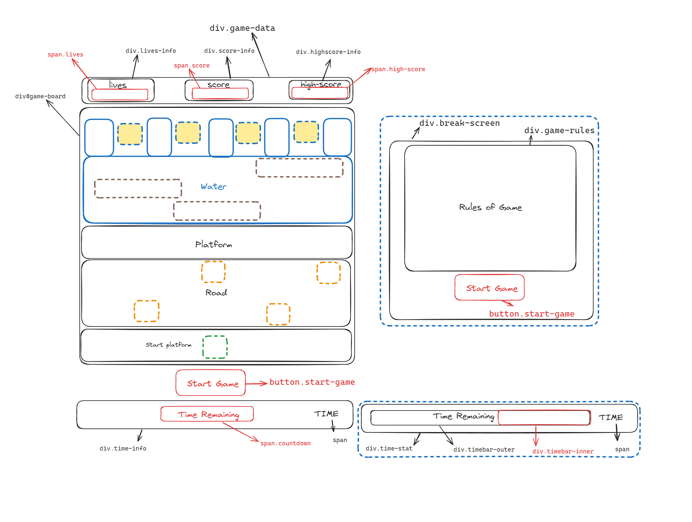

## Description
The Project selected is based on the 80s arcade game “Frogger”. The aim is to have similar elements to the game with the same visual queues. While the visual aspect of the game will not be kept at the forefront, my goal is to get all of the core functionality of the game working in a similar manner as to the game. 

## Deployment link
The project is available to view on my Github page. Link below :-
#### https://github.com/8055-NVW/Project-1--Frogger    

## Timeframe
1 Week

## Technologies Used

Kept it simple:
Visual Studio Code - For writing code
Chrome - For debugging

## Planning

## Build/Code Process

##### Day 1: Conceptualization and Initial Setup
Comprehensive sketch and wireframe of the game structure.
Creation of robust pseudo-code for the game logic.
Definition of HTML elements with appropriate classes and IDs.
Completion of the initial design iteration of the game layout using CSS.
Declaration of elements, variables, and functions in JS.
Construction of the game board.
Introduction of the frog character with logic for movement and boundary conditions.
Definition of lily pads (goal-point) on the board.

##### Day 2: Feature Implementation and Code Refactoring
Update to the project’s Readme file.
Introduction of a car (red div) on the screen with a predefined direction and speed.
Implementation of logic to detect when the snake reaches the lily pads (goal-point) and to reset its position.
Introduction of collision detection logic to reset the frog’s position upon collision.
Use of setInterval and setTimeout to set timers for the movement of the frog on the board.
Code refactoring to eliminate redundancy.

##### Day 3: Looping Logic and Multiple Object Implementation
Update to the Readme file.
Creation of looping logic that ensures only two objects are present per line.
Implementation of multiple objects on the screen.

##### Day 4: Collision Handlers and Aesthetic Enhancements
Implementation of logic for collision handlers on the frog and the obstacles.
Addition of the froggy texture and basic background colours to the CSS.
Update to the Readme file.

##### Day 5: Object Movement and Wrap Around Logic
Introduction of multiple objects, including logs, buses, and cars, on the screen.
Creation of a function to handle the movement of these objects either left or right.
Definition of the wrap-around logic for the moving objects on the screen.
Update to the Readme file.

##### Day 6: Game Loop and Collision Handler Refinement
Creation of a progress bar.
Refactoring of the countdown and initialising game functions.
Completion of functions to handle the game loop.
Refinement of the collision handler logic to run independently in the game loop.
Update to the Readme file.

##### Day 7 : Final Touches
Completion of the logic for the frog on logs.
Addition of the ability to save high scores.
Incorporation of sounds into the game and creation of a sound asset folder.
Addition of textures to the game via CSS.
Update to the Readme file.

## Challenges

Understanding how to use and where arrays in the initial stages to initialise the positions of all the obstacles/moving objects on the page was a challenge. I kept wanting to use an object initially but I could not figure out how.

Fighting out how to handle the movement of the obstacles was not as hard as trying to manage left and right direction  movement of the obstacles. I initially attempted to unify them into one function but could not figure out how to dispute multiple attempts. I settled on using two independent functions to handle this.

Managing overlapping classes(textures) in the game for e.g. the class of frog overlapping the class of grass and so on. My error was my incorrect CSS selectors. But this took a while to realise and almost had me settling on using solid background colours.

By far the most time consuming challenge was figuring out the logic of moving the frog on log. Conceptually this seems simple enough but in practice was not. At the time I had a hard time handling the out of bounds for the frog and ensuring a loss if the frog goes over the edge on the left or the right. I could get just  the left working or just the right but not both together. It was actually not my logic but rather the placement of the logic in the codeblock that fixed this for me. Again, Rubber Ducking really helped here

## Wins

Was able to stick to most of my wireframe designs without too much deviation.

Being able to sort out most of the major issues with the code by myself albeit with a lot of rubber ducking.

I learned so much more than I initially would have thought to learn just from attempting this project.

Having to refactor the code multiple times although time consuming has allowed me to get rid of alot of reused and repetitive code.
I actually enjoy playing the game to a point where I feel motivated to build on this and make more changes to it.

## Key Learnings/Takeaways

Feel a lot more comfortable with structuring the code and the process through:  Wireframing to Pseudocode and breaking down functions and Nesting them on others.

The concept of Rubber Ducking to fix problems by utilising console.log() to pinpoint where a potential problem could be.

 Pushing my project to Github and finally deploying it. Understanding the importance of having a version of the code as a fallback in case of data loss issues

## Bugs

Movement of frogs on the logs although sorted is still not perfect resulting in the froggy position being reset falsely.

## Future Improvements

Would like to add more textures to the game.
 
Maybe attempt to smoothen out the movement of the objects on the board

Have the high score save even after the page is refreshed

Refactor the logic for the autonomous movement of objects as I believe that can be made into a single function.

Aim to finish logic to store highscores and display them even after the page has been refreshed.

## Bug Fixes v1

Recieved helpful input from a user Nathan who found a bug with the a loss being initiated if the frog was postioned on the top left most part of the screen.
This was being caused due to faulty logic handling the frogs positiion on the log.
Have improved this to insure correct functiong of the game.